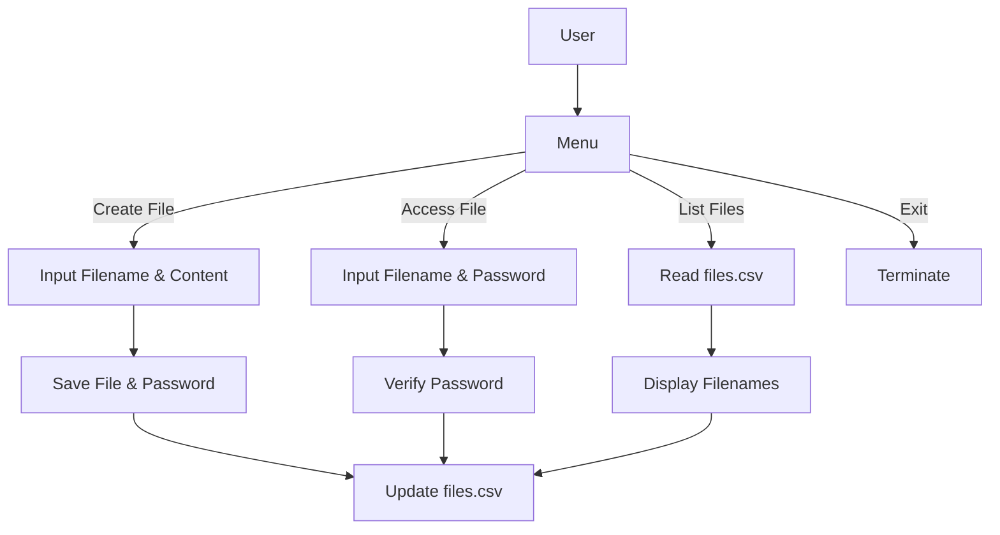
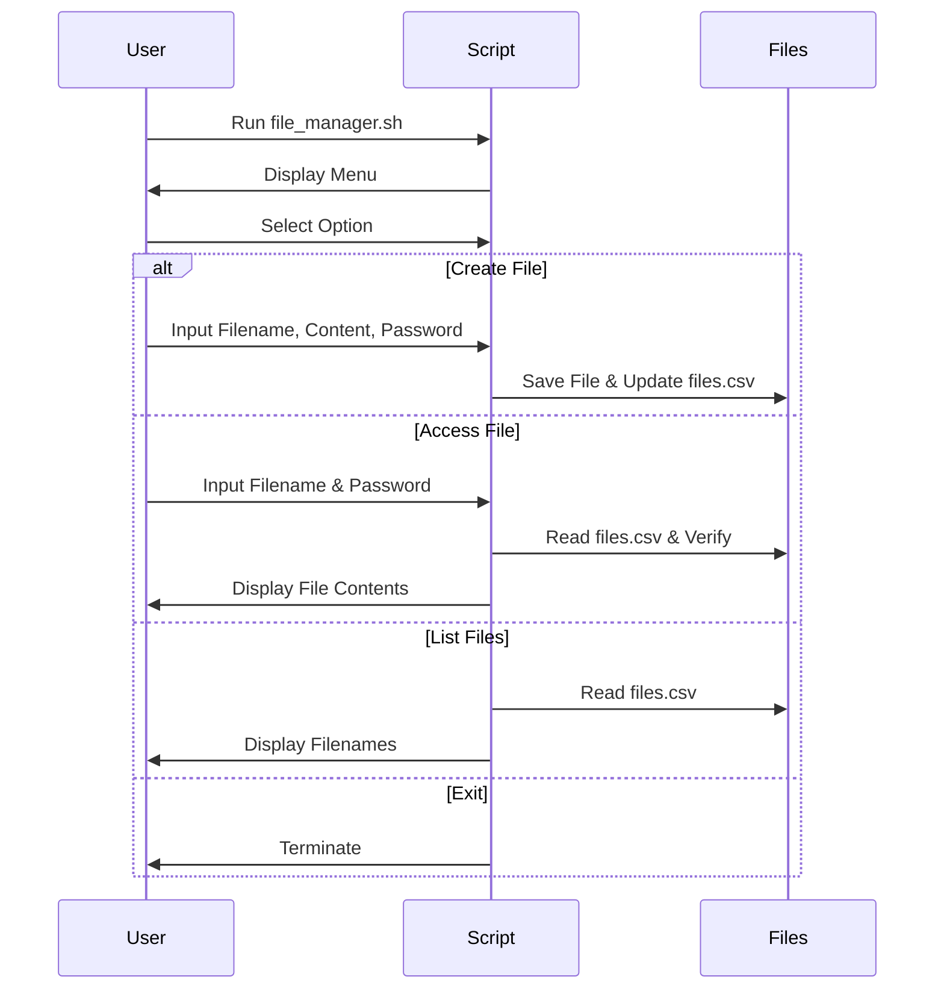

# File Management System

[](https://www.gnu.org/software/bash/)
[](https://github.com/Rakshak-D/Filemanager/issues)
[](LICENSE)

A Bash-based File Management System for creating, accessing, and listing password-protected files, with metadata stored in a CSV file for secure file access control.


---

## ✨ Key Features

### 📂 File Creation
- Create new text files with user-specified filenames.
- Allow users to input file contents interactively (terminated with Ctrl+D).
- Assign a password to each file for secure access.
- Store filename and password in `files.csv` for tracking.

### 🔒 File Access
- Access existing files by entering the correct filename and password.
- Provide three attempts to enter the correct password before locking out.
- Display file contents upon successful authentication.

### 📋 File Listing
- List all accessible filenames stored in `files.csv`.
- Present filenames in a numbered, formatted list for easy reference.

### 🔐 Security
- Password protection for file access with attempt limiting.
- CSV-based storage of file metadata (filename, password).
- Input validation to prevent incorrect or malicious inputs.

### 🖥️ User Interface
- Interactive console menu with four options: create file, access file, list files, or exit.
- Clear prompts and error messages for user guidance.
- Formatted output for file lists and contents.

---

## 🚀 Quick Start

### Prerequisites
- Bash shell (version 5.0+ recommended)
- Unix-like operating system (e.g., Linux, macOS, or WSL on Windows)
- Write permissions in the working directory

### Setup Instructions
```bash
# Clone repository
git clone https://github.com/Rakshak-D/Filemanager.git
cd Filemanager

# Make the script executable
chmod +x file_manager.sh

# Run the script
./file_manager.sh
```

**Input Requirements:**
- The script creates a `files.csv` file in the working directory to store filename-password pairs.
- Files created by the script are saved in the same directory.
- Example `files.csv` format:
  ```
  document1.txt,pass123
  notes.txt,secret456
  ```

**Example Run:**
```bash
Welcome
Enter your choice:
1. Create new file
2. Access a file
3. Check all accessible files
4. EXIT
Choice: 1
Type the filename: document1.txt
Type the contents in the file (press Ctrl+D to finish):
Hello, this is a test file.
Type the password: pass123
File created successfully.
```

---

## 🌐 Project Overview

### System Diagram


### Execution Flow


---

## 🛠 Technology Stack

| Component       | Technologies                                |
|-----------------|--------------------------------------------|
| **Scripting**   | Bash (Shell Scripting)                     |
| **Data Storage**| CSV File (files.csv)                       |
| **Functionality**| File Creation, Access, Listing             |
| **Dependencies**| Standard Bash utilities (cat, read, echo)  |

---

## 📂 Repository Structure

```
Filemanager/
├── file_manager.sh     # Main Bash script
├── Files.csv           # Metadata file (created at runtime)
├── README.md           # Project documentation
├── LICENSE             # MIT License
└── .gitignore          # Git ignore file
```

---

## 📝 Core Dependencies

- Standard Bash utilities (included with any Unix-like system):
  - `echo` (output text)
  - `read` (user input)
  - `cat` (file creation and display)
  - `while`/`case` (control flow)

No external dependencies required.

---

## 🐛 Issue Reporting

[](https://github.com/Rakshak-D/Filemanager/issues)

**Bug Report Template:**
```markdown
## Description
[Describe the issue clearly]

## Reproduction Steps
1. Run script...
2. Select option...
3. Observe...

**Expected Behavior**
[What should happen]

**Actual Behavior**
[What actually happens]

**Environment**
- OS: [e.g., Ubuntu 22.04]
- Bash Version: [e.g., 5.1.16]
- Input Files: [e.g., files.csv contents]

**Additional Context**
[Screenshots, error messages]
```

**Issue Labels**
- `bug` - Script or output errors
- `enhancement` - New feature requests
- `documentation` - README or comment improvements

---

## 📜 License

This project is licensed under the MIT License - see [LICENSE](LICENSE) for details.

---

## 📬 Contact & Support

**Project Maintainer**  
Rakshak D  
📧 rakshakmce@gmail.com  
🔗 [GitHub Profile](https://github.com/Rakshak-D)

---

## 🛠️ Development Roadmap

### Next Milestones
- Add file deletion functionality
- Implement password hashing for enhanced security
- Support file editing with authentication
- Add file categorization or tagging

### Contribution Guide
1. Fork the repository.
2. Create a feature branch (`git checkout -b feature/new-functionality`).
3. Commit changes (`git commit -m 'Add new functionality'`).
4. Push to branch (`git push origin feature/new-functionality`).
5. Open a Pull Request.

**Code Standards**
- Follow Bash scripting best practices.
- Include clear comments for script sections.
- Ensure portability across Unix-like systems.
- Test with sample files and `files.csv`.

---

